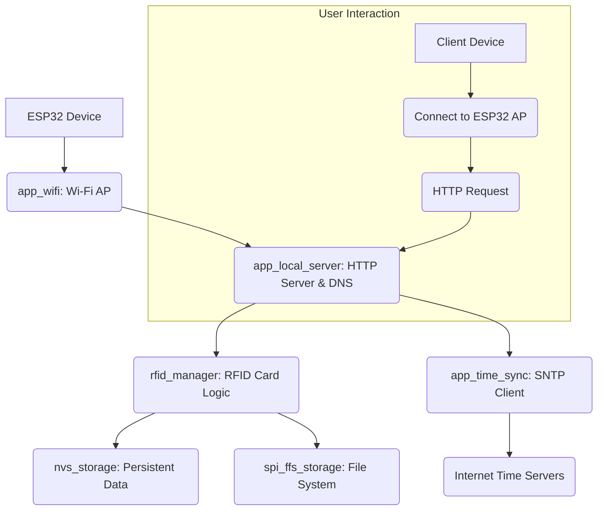
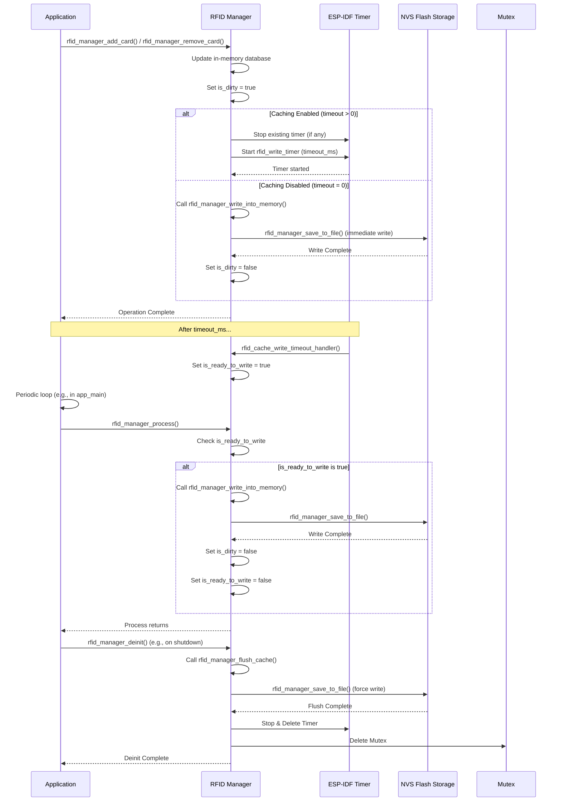

# Captive Portal with Advanced RFID Management

[](https://github.com/Tabrez-dev/CaptivePortal_Custom/actions)
[](https://github.com/espressif/esp-idf/releases/tag/v5.1.5)
[](LICENSE)

This project implements a **custom Captive Portal** for the **ESP32** platform, built upon the robust **ESP-IDF framework**. Beyond standard captive portal functionalities, it features a highly optimized and thoroughly tested **RFID Card Management System**, designed with embedded systems best practices in mind.

## Features 🚀

- 📶 **Wi-Fi Access Point (AP mode) setup** for network provisioning.
- 🌐 **DNS server redirection** to capture all user traffic and enforce captive portal.
- 🖥️ **Local Webpage hosting** for intuitive captive portal interaction and RFID card management.
- 🕒 **SNTP Time synchronization** for accurate timestamping and system operations.
- 📂 **Modular Code Structure** ensuring maintainability and scalability.
- 💳 **Robust RFID Card Management**:
    - Persistent storage of RFID card data using **NVS (Non-Volatile Storage)**.
    - **Optimized write caching mechanism** to minimize flash wear and extend device lifespan.
    - Thread-safe operations using **FreeRTOS Mutexes**, including recursive mutexes for complex nested calls.
    - Comprehensive **unit test suite** covering core functionality, edge cases, and persistence.

## Architecture Overview 🏗️

The system is designed with clear separation of concerns, leveraging ESP-IDF components for robust operation.



## RFID Manager: A Deep Dive 🧠

The `rfid_manager` component is engineered for reliability and efficiency, critical for embedded applications.

### Persistent Storage

RFID card data is securely stored in the ESP32's **Non-Volatile Storage (NVS)** partition, ensuring data persistence across reboots. This leverages ESP-IDF's NVS component for key-value pair storage, providing a robust and efficient solution for structured data.

### Optimized Write Strategy (Caching)

To mitigate flash wear, a common concern in embedded systems due to limited write cycles, the `rfid_manager` implements a sophisticated write-caching mechanism:

*   **Problem**: Frequent write operations (e.g., adding/removing cards) directly to flash can degrade its lifespan.
*   **Solution**: Changes to the RFID database are first applied to an in-memory copy. A configurable `esp_timer` is then started. The actual write to NVS only occurs when this timer expires, effectively coalescing multiple rapid changes into a single flash write.
*   **Asynchronous Processing**: A dedicated `rfid_manager_process()` function, called periodically from the main application loop, handles the actual NVS write when signaled by the timer, preventing blocking operations in critical paths.



### Thread Safety with Recursive Mutexes

To ensure data integrity and prevent race conditions in a multi-threaded FreeRTOS environment, the `rfid_manager` utilizes **FreeRTOS Mutexes**. Specifically, `xSemaphoreTakeRecursive()` and `xSemaphoreGiveRecursive()` are employed in functions like `rfid_manager_write_into_memory()`. This design choice is crucial because it allows a task that already holds the mutex to re-acquire it when calling nested functions that also require mutex protection, preventing self-deadlocks and ensuring robust concurrent access to shared resources.

### Robust Deinitialization

The `rfid_manager_deinit()` function is implemented to gracefully shut down the component. It ensures that any pending cached data is flushed to NVS before releasing system resources (like the `esp_timer` and FreeRTOS mutex), preventing data loss during application shutdown or module reinitialization.

## Comprehensive Unit Testing ✅

The `rfid_manager` component is backed by a comprehensive unit test suite built with the **Unity Test Framework**. This suite adheres to embedded testing best practices:

*   **Automated Setup/Teardown**: `setUp()` and `tearDown()` functions ensure a clean and consistent environment for each test case, initializing and deinitializing the RFID manager and its resources.
*   **Core Functionality**: Thoroughly tests adding, getting, removing, checking, listing, and JSON serialization of RFID cards.
*   **Error Handling**: Validates behavior with invalid parameters and full database conditions.
*   **Persistence & Recovery**: Includes a critical test that simulates file corruption (by deleting the NVS file) and verifies the manager's ability to recover by loading default data.
*   **Performance/Stress**: A "Fill Database" test pushes the system to its capacity limits.
*   **Caching Mechanism Validation**: Dedicated tests verify the delayed write logic, timer expiry, multiple operations coalescing, manual flushing, and disabling of caching.

## Getting Started 🛠️

### Prerequisites

- ESP32 Development Board
- ESP-IDF (v5.1.5 or later recommended)
- VS Code or any other IDE
- Python 3.x

### Build and Flash

```bash
# Set up ESP-IDF environment
. $HOME/esp/esp-idf/export.sh

# Navigate to project directory
cd captive_portal

# Build the project
idf.py build

# Flash to ESP32
idf.py -p /dev/ttyUSB0 flash monitor
```

*(Replace `/dev/ttyUSB0` with your correct COM port.)*

---

## How it Works ✨

1.  The ESP32 starts as a Wi-Fi Access Point.
2.  It launches a minimal DNS server that redirects all domains to its own IP.
3.  It hosts a local webpage for users who connect, which also serves as the interface for RFID card management.
4.  The RFID Manager handles secure and efficient storage of card data, with optimized write operations.
5.  After successful captive portal interaction, it can optionally synchronize time via SNTP servers.

---

## Future Improvements 🔮

- Add HTTPS support for captive portal
- Integrate external cloud time servers
- Add authentication/authorization for portal
- Provide captive portal detection compatibility for more OSes
- Implement OTA (Over-The-Air) updates for firmware
